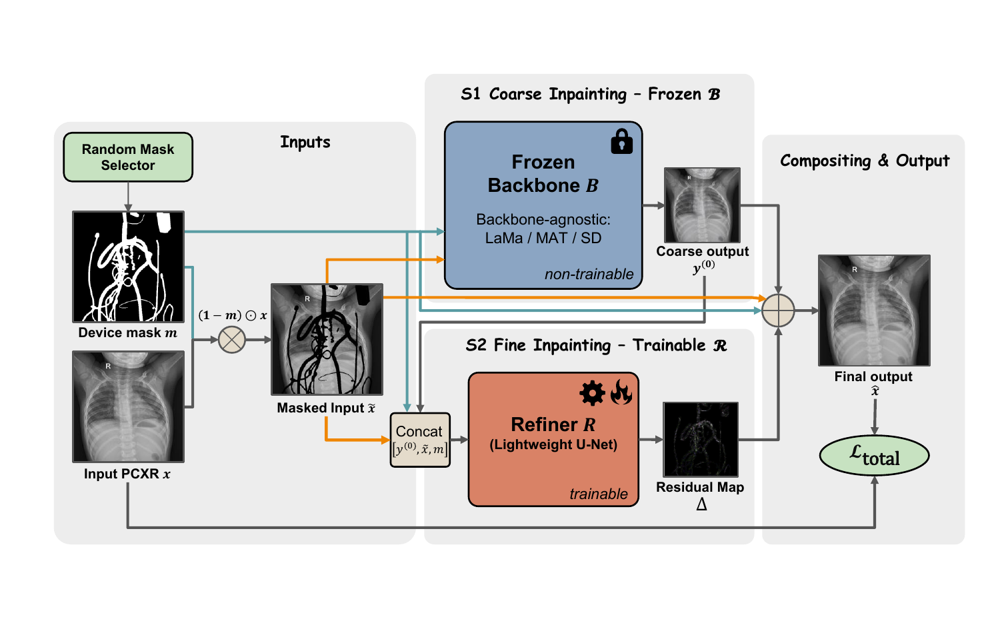
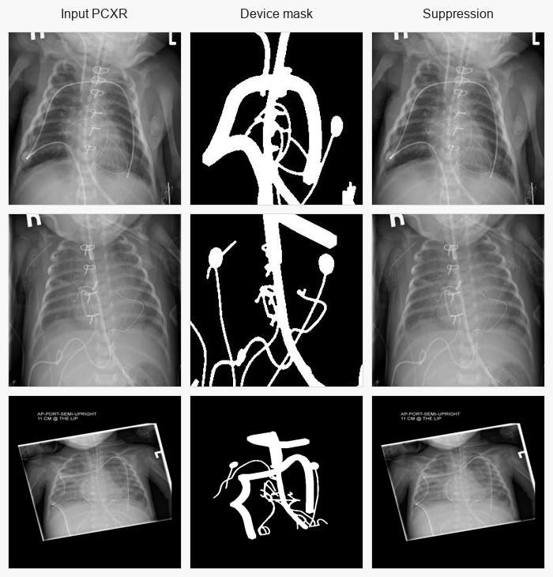

<div align="center">

# LightRefine-PCXR

**A lightweight refinement framework for medical device suppression in pediatric chest X-rays**

**Accepted at Medical Imaging with Deep Learning (MIDL) 2026**  
[OpenReview PDF](https://openreview.net/pdf?id=nixf7QdyXX)

</div>

This repository provides the LaMa-based implementation of **LightRefine-PCXR**. The method suppresses medical devices such as tubes, lines, and catheters in chest X-rays using mask-guided inpainting refinement; although the paper focuses on pediatric CXR, the framework is designed as a general CXR device-suppression strategy.

## Method

LightRefine-PCXR pairs a frozen pretrained inpainting backbone with a compact anatomy-aware residual refiner. It restores masked device regions while preserving all unmasked pediatric anatomy exactly through hard composition.

<p align="center">
  
</p>

## Clinical Examples

Representative clinical cases are shown below. Each row contains the original pediatric CXR, the device mask, and the suppression process.

<p align="center">
  
</p>

## Installation

```bash
conda create -n lightrefine python=3.10 -y
conda activate lightrefine

# Install the PyTorch build that matches your CUDA version.
pip install torch torchvision
pip install -r requirements.txt
```

## Checkpoints

Download the official **Big-LaMa** checkpoint and place it as:

```text
big-lama/
  config.yaml
  models/
    best.ckpt
```

The released LightRefine checkpoint is expected at:

```text
refiner_ckpt/lama_refiner.pth
```

## Configuration

Edit [configs/refiner/lama_refiner.yaml](configs/refiner/lama_refiner.yaml) before running. The main fields are:

```yaml
paths:
  lama_config: path/to/big-lama/config.yaml
  lama_checkpoint: path/to/big-lama/models/best.ckpt
  refiner_checkpoint: refiner_ckpt/lama_refiner.pth

inference:
  image_dir: path/to/inference/images
  mask_dir: path/to/inference/masks
```

Command-line overrides are still supported for quick changes:

```bash
python bin/infer_lama_refiner.py inference.image_dir=/new/images
```

## Inference

For inference, you can directly use the provided LightRefine checkpoint at `refiner_ckpt/lama_refiner.pth`. Only the Big-LaMa backbone checkpoint and your image/mask paths need to be set in the config.

Masks are matched by filename stem:

```text
images/0001.jpg
masks/0001_mask.jpg
```

After updating the config:

```bash
python bin/infer_lama_refiner.py --config configs/refiner/lama_refiner.yaml
```

The raw refiner output is written to `inference.output_pred_dir`; the hard-composited suppression result is written to `inference.output_inpaint_dir`.

## Training

Training samples masks stochastically from a mask pool. Validation uses fixed image-mask pairs and is the only split used for checkpoint selection.

Set the training paths in `configs/refiner/lama_refiner.yaml`:

```yaml
paths:
  train_images: path/to/train/images
  train_masks: path/to/train/mask_pool
  val_images: path/to/val/images
  val_masks: path/to/val/masks
  output_dir: outputs/refiner
```

Then run:

```bash
python bin/train_lama_refiner.py --config configs/refiner/lama_refiner.yaml
```

Optional test-set reporting can be enabled in the config:

```yaml
paths:
  test_images: path/to/test/images
  test_masks: path/to/test/masks
evaluation:
  report_test: true
```

## Acknowledgements

This implementation builds on [LaMa](https://github.com/advimman/lama), released under the Apache-2.0 license. We thank the LaMa authors for making their code and pretrained inpainting models publicly available. Please also cite LaMa when using this LaMa-based implementation.

## Citation

If you find our work helpful, please cite:

```bibtex
@inproceedings{jiang2026lightrefine,
  title={LightRefine-PCXR: A Lightweight Refinement Framework for Efficient Medical Device Suppression in Pediatric Chest X-Rays},
  author={Jiang, Mingze and Li, Xueyang and Kheir, John and Girten, Alec and Shi, Yiyu},
  booktitle={Medical Imaging with Deep Learning},
  year={2026}
}
```
